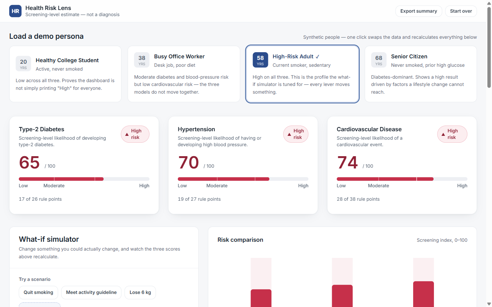
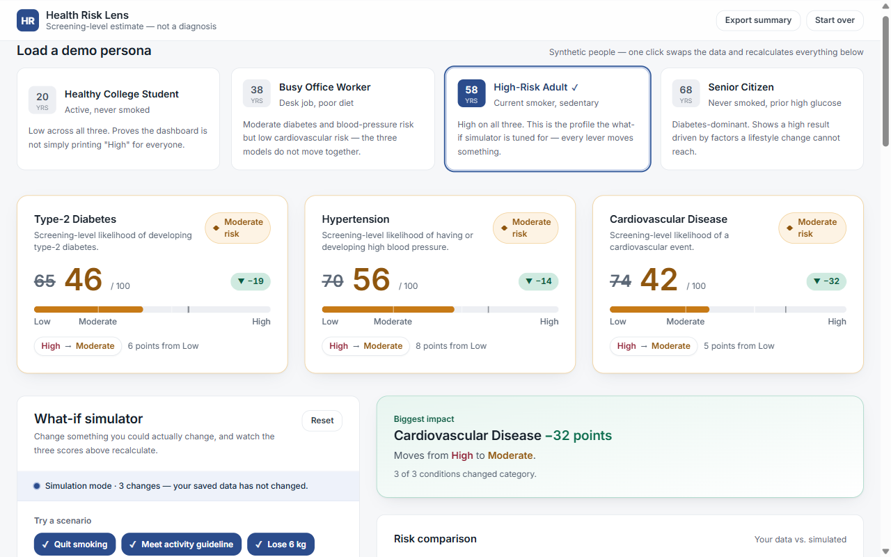
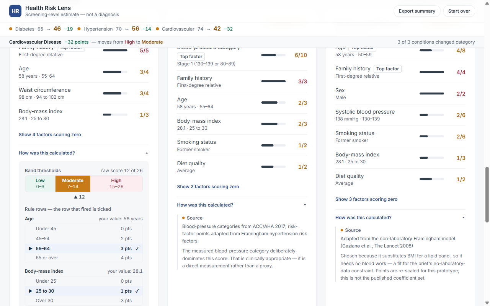

# Health Risk Lens

A screening-level health-risk dashboard. It estimates risk for three conditions from basic
health and lifestyle information, explains every point it awarded, and lets you simulate what
would happen if you changed something.

> **This is not a diagnostic tool.** Results are screening-level educational estimates produced
> by predefined scoring rules. The application does not recommend any medicine or treatment, and
> every profile in it is synthetic. Consult a qualified healthcare professional about your health.



## What you are looking at

Pick one of four synthetic people. Three separate instruments score them — type-2 diabetes,
hypertension, cardiovascular disease — and each returns its own Low / Moderate / High band from
its own published cut-points. Then change something a real person could change, and watch all
three recalculate.

**Apply a scenario and every number moves at once**, with the exact arithmetic beside it. The
three lifestyle changes below take this profile from High on all three conditions to Moderate on
all three:



**Nothing here is a black box.** Every card opens onto the band thresholds for that instrument
and the full rule table, with the row that fired ticked — so you can see not only what scored,
but what the alternatives were and where the boundaries sit. These rows are emitted by the
scoring engine itself, so the drawer cannot disagree with the score above it:



The three models genuinely disagree with each other — the office-worker persona is Moderate for
diabetes and blood pressure but **Low** for cardiovascular risk — which is the point. There is no
single hidden "health score" wearing three hats.

---

## Run it

```bash
npm install
npm run dev       # http://localhost:5173
npm run verify    # 525 scoring + provenance assertions — run first if you change a rule table
npm run smoke     # renders every screen and simulation state; fails if any component throws
npm run build
```

## What it does

- **Four demo personas** — one click swaps the whole profile and recalculates.
- **Health and lifestyle data entry** — 13 fields, live BMI and blood-pressure category.
- **Three separate risk estimates** — type-2 diabetes, hypertension, cardiovascular disease.
- **Low / Moderate / High** bands, each from its own instrument's cut-points.
- **Visual comparison** of the three results.
- **Contributing factors** — the full point breakdown per condition, with its source cited.
- **Instant recalculation** — no submit button, no debounce.
- **Data provenance** — "How was this calculated?" opens the band thresholds and the exact rule
  rows that fired.
- **PDF export** — a consultation-style summary via the print stylesheet.
- **What-if simulator** — the feature this build is designed around (below).

## The what-if simulator

Scoring is a pure function of a plain profile object:

```js
scoreAll(profile) -> { diabetes, hypertension, cardiovascular }
```

So simulation needs no new scoring logic at all — it is the same function called on a patched
copy:

```js
const current   = scoreAll(profile);
const simulated = scoreAll(applyOverrides(profile, overrides));
```

Three consequences worth knowing:

1. **Your data is never mutated.** `overrides` is a sparse patch held separately. "Reset to my
   data" is not a re-fetch, it is `setOverrides({})`.
2. **The explanation is exact.** Both sides came out of the same point tables, so diffing the two
   contribution lists gives the literal arithmetic — `smoking 6 → 2, −4`. It is not a
   feature-importance approximation. `npm run verify` asserts that the factor deltas sum exactly
   to the score delta.
3. **Recalculation is genuinely instant.** A few dozen table lookups per keystroke.

### Only modifiable factors are adjustable

The simulator exposes four levers: **smoking status**, **weight**, **physical activity**, and
**fruit & vegetable intake**. Systolic blood pressure sits under *Advanced*, labelled as an
outcome measure rather than a lever.

Age, sex, family history and previously recorded high blood glucose are shown **locked**. They
affect the score, but no lifestyle change alters them, so the simulator does not pretend
otherwise.

Two modelling choices are surfaced in the UI rather than hidden:

- **Quitting moves you to *former* smoker, not *never*.** Risk stays elevated for years after
  quitting, and the point table reflects that.
- **Waist circumference tracks weight** at roughly 0.8 cm per kg. The diabetes model scores waist
  separately from BMI, so freezing it would understate the effect. It is labelled as an estimate.

## Scoring

All three tables live in `src/data/rules/*.json` and are adapted from published instruments.
Bands are computed from the **raw** point total, never the 0–100 index, so the number on screen
and the category beside it can never disagree because of rounding.

| Condition | Basis | Max | Low | Moderate | High |
|---|---|---|---|---|---|
| Type-2 diabetes | FINDRISC (Lindström & Tuomilehto, *Diabetes Care* 2003) | 26 | 0–6 | 7–14 | 15–26 |
| Hypertension | ACC/AHA 2017 BP categories + Framingham risk factors | 27 | 0–7 | 8–15 | 16–27 |
| Cardiovascular | Non-laboratory Framingham (Gaziano et al., *The Lancet* 2008) | 38 | 0–11 | 12–22 | 23–38 |

**Adaptations, stated plainly:**

- FINDRISC's five official categories are collapsed to three, as the brief requires.
- The cardiovascular points are re-scaled for this prototype; they are not the published
  coefficient set. That model was chosen because it substitutes BMI for a lipid panel, so it
  needs no blood work.
- Physical activity uses a single 150 min/week cut-point across all three models for consistency.
- One family-history field feeds all three conditions, rather than three separate fields.
- The instruments are sex-binary. "Prefer not to say" resolves to the female reference table,
  which uses the lower waist thresholds.

**Cross-condition coupling:** a High diabetes result adds 3 points to the cardiovascular score,
because type-2 diabetes is itself a cardiovascular risk factor. This makes the scoring order
load-bearing — diabetes is scored before cardiovascular in `scoreAll`. Non-circular by
construction; do not reorder those three lines.

The three thresholds are deliberately **not** forced onto identical cut-points. Each condition's
`ScoreTrack` draws its own band boundaries. Making the chart tidier would have meant fudging the
instruments.

## Demo personas

Every person here is fictional. The set is chosen so the three models visibly **disagree** — if
every persona scored the same band across all three conditions, a judge would reasonably suspect
one underlying "health score" wearing three hats. Verified by `npm run verify`:

| Persona | Profile | Diabetes | Hypertension | Cardiovascular |
|---|---|---|---|---|
| 🎓 **Healthy College Student** | 20 F · BMI 21.8 · never smoked · 120 min/wk | 8 Low | 7 Low | 5 Low |
| 💼 **Busy Office Worker** | 38 M · BMI 28.4 · desk job · poor diet | 38 Moderate | 44 Moderate | **24 Low** |
| ⚠️ **High-Risk Adult** | 58 M · BMI 30.1 · current smoker · sedentary | 65 High | 70 High | 74 High |
| 🧓 **Senior Citizen** | 68 F · BMI 31.6 · prior high glucose | 92 High | 56 Moderate | 53 Moderate |

The office worker is the interesting one: Moderate diabetes and blood pressure but **Low**
cardiovascular risk, because he is young and has never smoked.

The persona strip sits **above** the risk cards rather than inside the data-entry accordion.
Clicking a persona changes the three cards already on screen — the same cause-and-effect
co-visibility the what-if panel is built around. Selecting one also clears any active simulation.

`PERSONA_HIGH_RISK` is numerically **frozen**: the what-if demo arc is tuned to it.

| Step | Diabetes | Hypertension | Cardiovascular |
|---|---|---|---|
| Start | 65 High | 70 High | 74 High |
| Quit smoking | 65 — *no change* | 67 High | 63 High |
| + 150 min/week | 58 High | 59 High | 55 **→ Moderate** |
| + lose 6 kg | 46 **→ Moderate** | 56 **→ Moderate** | 42 Moderate |

Step 1 exercises the "no change to this risk" state live — smoking does not feed the diabetes
model. Step 3 crosses the remaining two bands and switches the diabetes→cardiovascular coupling
off.

## Data provenance

Each Contributing Factors card has a **"How was this calculated?"** expander showing:

- **Band thresholds** for that instrument, drawn to scale, with a marker at the current raw score.
- **Every rule row** each factor could have matched, with the one that fired ticked — so you see
  not just what scored but what the alternatives were, and where the boundaries sit.
- The source instrument and the adaptations made to it.

The rows are emitted by the scoring engine itself (`contribution.rule` in `scoreCondition.js`),
not recomputed by the UI, so the drawer is a pure renderer and cannot drift from the score above
it. `npm run verify` asserts, for all 104 factor evaluations across every persona, that **exactly
one row is active** and that **the active row's points equal the score that factor contributed**.
Without that assertion a lying drawer would look exactly like a correct one.

## PDF export

"Export summary" calls `window.print()` against a purpose-built `PrintReport` component — a
consultation document with a masthead, profile table, results table, simulated changes (when the
simulator is active) and the disclaimer. Not the dashboard with pieces hidden.

Chosen over html2canvas/html2pdf and jsPDF deliberately: **zero dependencies**, and the output is
real vector text — sharp, selectable, tens of KB instead of a multi-MB screenshot. html2canvas
would also have mishandled the gradient callout, the `backdrop-blur` header and the sticky strip.

**Caveat:** this opens the browser print dialog, so the user picks "Save as PDF" — two clicks
rather than a silent download. jsPDF is the upgrade path if a true one-click download is wanted
later.

## Architecture

No backend, no database, no API calls, no router, no state library, no machine learning. It is a
single-page React app; the rules are JSON and the scoring is synchronous. A zero-backend demo
cannot fail on conference wifi.

```
src/
  data/rules/*.json      the three point tables — open them, that is the point
  data/factors.js        form metadata + which factors are modifiable
  data/demoProfiles.js   the four demo personas
  lib/scoring/           derive · scoreCondition · scoreAll · bands · conditions
  lib/simulation/        applyOverrides · summarizeSimulation · presets
  hooks/                 useRiskResults · useCountUp
  components/
    layout/ form/ results/ whatif/ personas/ print/
  pages/                 Landing · Dashboard
scripts/
  verify-scoring.mjs     525 assertions, plain node
  ssr-smoke.jsx          renders every screen + simulation state
```

`scoreCondition.js` evaluates all three conditions — the difference between them lives entirely
in JSON.

## Verification

`npm run verify` covers derived metrics and their guards, band boundaries (including BMI at
exactly 25.0 and 30.0), all four personas and their metadata, each step of the demo arc, override
hygiene (no-op overrides are dropped; the profile is never mutated), the simulation summary
including worsening changes and the empty diff, and the provenance rule-row invariants described
above.

`npm run smoke` server-renders both pages and six simulation scenarios — no overrides, a single
change, the full arc, a change that makes things worse, a no-op override, and an already-low
profile.

Accessibility and demo-room notes: every band pairs colour with a glyph and a word; numbers use
`tabular-nums` so count-up animation does not shift the layout; sliders are keyboard-operable
(use arrow keys on stage); `prefers-reduced-motion` disables the count-up.
